<h1>NOTE(THE CURRENT VERSION OF RED RABBIT IS VERSION 5, THIS REPO STAYS TO THE VERSION 4 STANDARD) MAJOR UPDATE COMING SOON, ALOT OF TOOLS HAVE BEEN DEPRECATED PLEASE WAIT FOR VERSION 6 to COME OUT BEFORE USING AS A TOOL, THIS IS UNDERGOING MAJOR CHANGES IN CODE BLOCKS</h1>

<h2> FIXES LIST FOR VERSION 1.0 COMING OUT SDOON! 'x finally out of beta x' </h2>

```
---- so summing up everything thats new here is a small list 
Code is more robust 
Code is more responsive 
Code is more specific 
Error messages are more specific 
Files are more organized
Added json and .db files for more list reading 
Added optional command line flags 
Added Graphical User Interfaces for all perl like tools 
Added Classes and Modules for ruby files making for a faster response time and easy manipulation
Added better and more organized / detailed output 
Added more digital forensics tools
Added WEBP, PNG, JPG, JPEG, GIF, BMP, MP4 audio injection 
Added more utilities for web exploitation 
Added more utilities for wifi hacking 
Added a better system of automation 
Added color and output modules 
Replaced main.rb with main.go 
Replaced 90% of scripts from python, r, asm to golang 
Replaced function types
Fixed enviroment errors 
Fixed CPU conflict
Fixed hardware Resource take ups 
Fixed console error in catching statements 
Fixed large and confusing output when SIG KILL is triggered
Fixed large and confusing output when SIG CTRL is triggered
Fixed large and confusing output when ruby files will error out 
Fixed a large amount of panic errors in the ARP functions 
Fixed panic errors or runtime errors during arp sessions 
Fixed Compatibility issues 
Fixed language install issues 
Fixed library compatability issues, everything is now raw or ported through golang and perl which most are standard 
Fixed horrible install files 
Fixed sessions 
Fixed the issue with the root error GUI popping up, now script MUST be run as root 
Fixed the output glitch 
Fixed the in development scripts 
Fixed the input errors you would get 
Fixed input 
Fixed errors when entering the wrong command, if you enter the wrong command this time it wont do anything
Fixed format errors 
Fixed color format issues 
Fixed /b characters which when large output would happen a noise would be called from the terminal
[10:24 PM]
Fixed Corrupted output errors, when users got mass input some would corrupt and become special characters in a way 
Fixed unicode bugs 
Fixed WebUI errors 
Fixed WebUI Messages and formatting bugs 
Fixed FILESERVER Issues with logging output and switching the url response 
Fixed Go files which had warnings in them such as function unused 
Fixed Output errors with tracers or osint utilities 
Replaced python with perl
Added more robust ruby modules to make sure code is safe and flexible 
Added a perl console for fixing issues or automating cleanup and installs 
Added makefile for install of libwhisker and OFSL ( Offensive Secrurity Perl Module RR6 ) to the root paths 
Added more manipulation and control over what wordlists and files can be used 
Added more robust and advanced code to the PNG injection library 
Added the use of OUI or Mac Vendor lists 
Added OUI identification during ARP, PORT, or Single recon sessions 
Updated the use of SQL Injection tools 
Updated the help menus to allow users the control over what format it is (JSON, TXT, etc)
Updated the file to hold flags for output, if the display setting is landscape output will be fixed to that 
Updated the commands list 
Updated the command output and description 
Updated the fields 
Added better recon tools 
Ported Exploits from C to Go 
Ported Past ruby code into Go 
Ported Past Python code into ruby or go 
Eliminated the use of python 
Eliminated the use of everything being automated by system commands
Eleminated the use of horrid modules 
Eliminated the use of modules that could have been rewritten
Eliminated bar code generation module, the developers have no fixed the errors in the library yet
Eliminated over done scripts or over bloated files 
Eliminated junk files 
Eliminated unused chunk's of code 
Added better functions 
Cut down on the amount of hardware needs for the script
Cut down on the use of large amounts of output that is not needed 
```


```
 ____       ______     _____     ______     ______     ______     ______     __     ______  
/\  == \   /\  ___\   /\  __-.  /\  == \   /\  __ \   /\  == \   /\  == \   /\ \   /\__  _\ 
\ \  __<   \ \  __\   \ \ \/\ \ \ \  __<   \ \  __ \  \ \  __<   \ \  __<   \ \ \  \/_/\ \/ 
 \ \_\ \_\  \ \_____\  \ \____-  \ \_\ \_\  \ \_\ \_\  \ \_____\  \ \_____\  \ \_\    \ \_\ 
  \/_/ /_/   \/_____/   \/____/   \/_/ /_/   \/_/\/_/   \/_____/   \/_____/   \/_/     \/_/ 

Version 5.0                            Interactive Console                 Scare_Sec_Hackers                                                                                            
---------------------------------------------------------------------------------------------
                                               ((`\
                                            ___ \\ '--._
                                        .'`   `'    o  )
                                        /    \   '. __.'
                                      _|    /_  \ \_\_
                                     {_\______\-'\__\_\
                                     For Hackers
                                          By Hackers


RR5> 
```


Its finally here! Red Rabbit version 5.0 finnally only took us 40 effing years XD
<br>
# What is the Red Rabbit Project
<hr>
In short, the Red Rabbit Project is a project that attempts to touch every field of programming and hacking, this includes using languages like perl and ruby, and touching fields of hacking like white hat hacking and green hat hacking, this frameworks main goal is to help people in both attacks, pentesting engangements as well as just over all having fun and getting to help the user learn more about hacking, Red Rabbit  Consists of many fields such as network recon, web recon, web exploitation, stegeanography, SSH Possession, OSINT, Exploitation and more. This script features many tools to auto exploit certian services like SOAP vTIGER services, PHP applications, RFI LFI vulnerable hosts, SQL Injectable MYSQL servers, and so much more among that range. 
<hr>

<br>

# general installs and helpful information

<br>

when installing red rabbit i want you to know that while it seems like there is alot of libs that are being installed there isnt, a cool thing about the RR5 modification is alot of the useless code in ASM, C, RAK, M40, or fortran was converted all to golang, when you run a install go file all the installs and modules do not stay in your root GOPATH they actually just sit in a file called go.sum, which in the case you need to free up space and RR5 you need to delete all the modules you install in go will automatically go away once you delete the RR5 path, because you have deleted the go.sum package, but when you do delete this file and still want to use RR5 you will not be able to use it properly given most close to all scripts utilize GO
<br>
<h4>All in one install</h4>

```
git clone https://github.com/ArkAngeL43/Red-Rabbit-V5 ; cd Red-Rabbit-V5 ; chmod +x ./INSTALL_RR5.sh ; ./INSTALL_RR5.sh
```

when you are done run the command -> sudo ruby main.rb 

# Absolute requirements when running this script

<br>

When running RR5 you want to ensure that you are a root user to do this just run the file as `sudo ruby main.rb` or log into a root shell on your machine by typing `sudo -su` if you are not root and you still choose to run the script, you will get the following ANNOYING VERY VERY ANNOYING BRIGHT blue warning GUI
which looks like the following

<br>

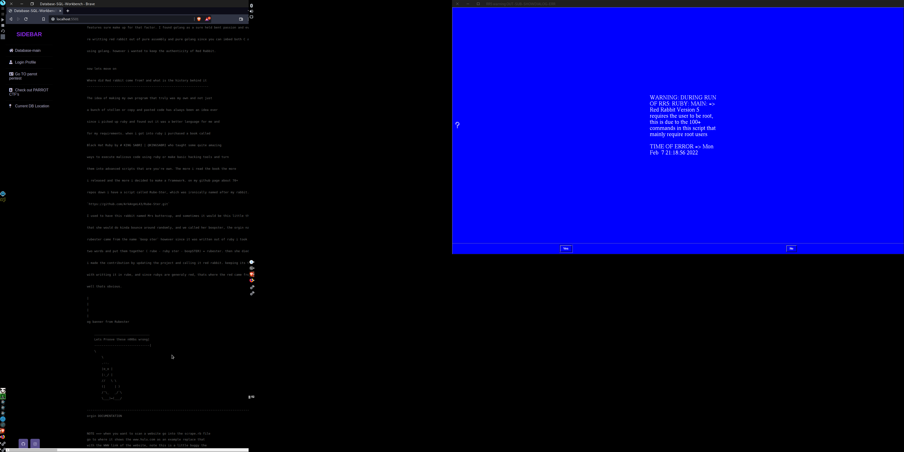
<br>
# Interacting with the documentation
<br>

so during the development of RR5 i told yall i was going to add a web UI to the red rabbit script, and i did, while its not exactly what yall wanted its still something, let me first off start by saying the documentation for RR5 IS FUCKING HUGE, there is over 110+ commands in this script and i talk about each and every one about how it works, how to work with it, how you would use it, how it actually works along side of the console, and how everything is sent. You may be wondering why i would do this, for one no tool can have to much documentation in my opinion, and second because this tool is supposed to work as a learning utility for people as well, instead of just another script to fuck people over with. as i mentioned at the top
now in this script i added a really nice dashboard and web UI for this tools docmumentation, which also works alot better with the eyes XDDD. when you enter the command in the RR5 directory ( AFTER INSTALLS ) then you will get prompted to a console input, when you get into the console to get to the documentation you will need to run the command doc_fullc which will launch a localhost server on port 5501 this will be the following output

```

 ______     ______     _____     ______     ______     ______     ______     __     ______  
/\  == \   /\  ___\   /\  __-.  /\  == \   /\  __ \   /\  == \   /\  == \   /\ \   /\__  _\ 
\ \  __<   \ \  __\   \ \ \/\ \ \ \  __<   \ \  __ \  \ \  __<   \ \  __<   \ \ \  \/_/\ \/ 
 \ \_\ \_\  \ \_____\  \ \____-  \ \_\ \_\  \ \_\ \_\  \ \_____\  \ \_____\  \ \_\    \ \_\ 
  \/_/ /_/   \/_____/   \/____/   \/_/ /_/   \/_/\/_/   \/_____/   \/_____/   \/_/     \/_/ 

Version 5.0                            Interactive Console                 Scare_Sec_Hackers                                                                                            
---------------------------------------------------------------------------------------------
                                               ((`\
                                            ___ \\ '--._
                                        .'`   `'    o  )
                                        /    \   '. __.'
                                      _|    /_  \ \_\_
                                     {_\______\-'\__\_\

Server URL -> http://localhost:5501
Google URL -> http://127.0.0.1:5501
Server DB  -> PostGreSQL


```
<br>
When you follow this url you will get something alot like this image below

<br>

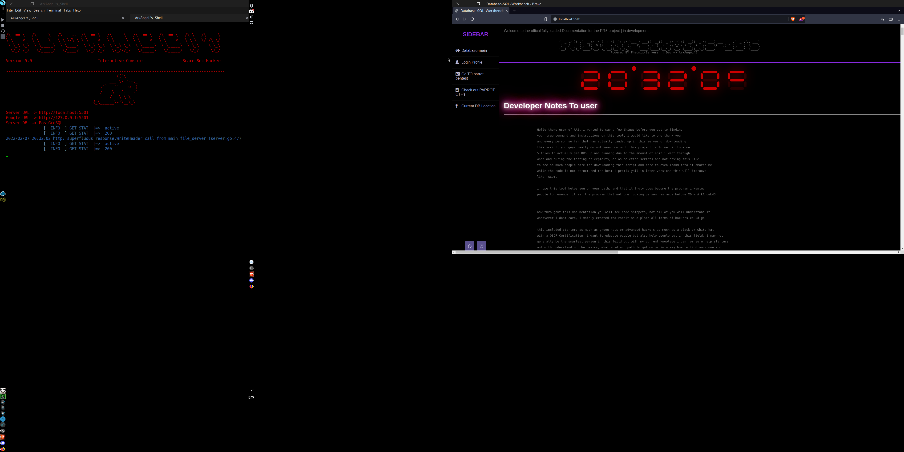
<br>
When you get to the web UI you will have practically everything you need around the major commands of this script, to compare here is a list of all current commands in RR5
<br>
```
Table of Contents:
        Working -> Command works and has been tested 
        Deving  -> Broken, Bugged or In current development
____________________________________________________________________________________________________
|______________|____________________________________________________________________________________|
|-> commands   | Show this command menu with the status                                    |Working |
|-> h          | Show this command menu with the status                                    |Working |
|-> help       | Show this command menu with the status                                    |Working |
|-> help-nosta | Show all cuurent commands without a status active true/false              |Working |
|-> ajax-wo    | Ajax spider without whois for every url scanned                           |Working |
|-> ajax-NK    | Ajax spider NUCLEAR aka a over powered crawler                            |Working |
|-> ajax-wu    | Ajax spider with whois for every url scanned   UNSTABLE                   |Working | 
|-> whois      | Get information on a domain such as nameservers                           |Working |
|-> xss-t      | Test a URL for XSS vulnerabilities                                        |Working |
|-> sql-t      | Test a URL for possible SQLI vulnerabilities                              |Working |
|-> kick_MSQL  | Extract table names and database names from vulnerbale MySQL Servers      |Working |
|-> MongMiner  | Extract data from vulnerable mongo databases via connect  IP Connect      |Deving  |
|-> MySQLMiner | Extract data from vulnerable MySQL databases via connect  IP Connect      |Deving  |
|-> fp-pillage | Walk filepaths for very important information such as users passwords etc |Working |
|-> Sniff-FTP  | Sniff cleartext FTP credentials on defualt port 21                        |Working |
|-> eth-sniff  | Dump, Log, and output TCP dump logs on interfaces (PS: this is amazing)   |Working |
|-> if-listen  | Find devices you can listen on before capturing network info              |Working |
|-> Sub_domfind| Run a Sub Domain Finder to guess domains and record CNAMES and A records  |Working |
|-> fake-ap    | Spawn fake 802.11 access points                                           |Working |
|-> SSH-B-R    | Brute force a SSH server   (ruby)                                         |Working |
|-> SSH-B-G    | Brute force a SSH server   (Golang)                                       |Working |
|-> SMTP-b     | Brute force a SMTP email                                                  |Working |
|-> FTP-b      | Brute force a FTP server                                                  |Working |
|-> LFI-PHI    | Command injection ( WARNING: STILL IN development VERY BUGGY DO NOT USE)  |Working |
|-> MD5-B      | Brute force a list of MD5 hashes                                          |Working |
|-> SHA256-B   | Brute force a list of SHA-256 hashes with optional password lists         |Working |
|-> SSH-p      | SSH possession                                                            |Working |
|-> SSH-i      | Inject SSH files into a host                                              |Working |
|-> ARP-DNS    | Arp spoof a client or network                                             |Working | 
|-> DHCMP-S    | Run a DHCMP attack                                                        |Working |
|-> port-r     | Run a port scanning tool in ruby to port scan websites                    |Working |
|-> port-r-h   | Run a port scanning tool in ruby to port scan HOST IPA's                  |Working |
|-> d-g        | Run a port scanning tool in Golang                                        |Working |
|-> port-g-l   | Run a port scanning tool in golang but for list scans and domains         |Working |
|-> dom-g      | Domain information grabber [ basic ]                                      |Working |
|-> F-dns      | Forward DNS lookup                                                        |Working |
|-> d-o        | Full domain OSINT                                                         |Working |
|-> URL-r      | Full URL recon                                                            |Working |
|-> HTML-r     | Download the HTML file of a webpage                                       |Working |
|-> r-dns      | Reverse DNS lookup                                                        |Working |
|-> ip-t       | Trace an IP                                                               |Working |
|-> PNT-U      | Phone number tracer US numbers only                                       |Working |
|-> CF         | Mine IPA's for cameras                                                    |Working |
|-> dm-b       | Route domain name connections to the loopback                             |Working |
|-> FTP-C      | FTP credential sniffer                                                    |Working |
|-> ftp-read   | FTP credential sniffer in analyzation of PCAPNG files                     |Working |
|-> FTP-R      | FTP Fuzzer [ruby]                                                         |Working |
|-> FTP-G      | FTP Fuzzer [Golang]                                                       |Working |
|-> JBOS-F     | Fuzz JBOS services with optional SSL                                      |Working |
|-> tcp-d      | TCP network traffic analyzer                                              |Working |
|-> hd         | Hex dumper                                                                |Working |
|-> W-SSID     | Wifi SSID/BSSID finder [ python ]                                         |Working |
|-> G-BSSID    | Wifi SSID/BSSID finder [ Golang ]                                         |Working |
|-> start-i    | Start interface [ airmon ]                                                |Working |
|-> stop-i     | Stop interface  [ airmon ]                                                |Working |
|-> si-phy     | Start interface [ phy-dev ]                                               |Working |
|-> s-phys     | Stop interface  [ phy-dev ]                                               |Working |
|-> SOAP-E     | Attempt to get a PHP shell on vTiger CRM SOAP Applications  in development|Working |
|-> ps-deam    | Get host information through a interactive deamon mode built with go      |Working |
|-> doc-dem    | Learn and read more about the documentation through a web UI              |Working |
|-> robo-get   | Get the robots .txt of a URL and download/save it to the Active directory |Working |
|-> QR=nolist  | Generate a QR code with a given URL ( Without parsing a list ) [ perl ]   |Working |
|-> QR=list    | Generate a QR code for every URL in a given list or file                  |Working |
|-> EXIF       | Gather basic EXIF data from an image using perl                           |Working |
|-> sqlf       | Run my forked version of SQLI_Finder, With a crawler                      |Working |
|-> sqlf=L     | Run the same as above but with a URL list to test without a ajax spider   |Working |
|-> generate-w | Generate wordlist files with random characters and numbers based on size  |Working |
|-> modules    | Check the loaded modules for RR5                                          |Working |
|-> Root-cm    | Check and look at all the Root commands for this script                   |Working |
|-> myip       | Gather your local, private, and public IP address                         |Working |
|-> MSF_Session| Gather all current metasploit sessions MUST HAVE MSF ENV EXPORTED         |Working |
|-> iface      | Gather a list of your current interfaces                                  |Working |
|-> dump-pcap  | Dump a pcap file                                                          |Working |
|-> warnings   | View possible warnings that are user based in script [POP UP WILL OCCURE] |Working |
|-> Proto-IP   | Check wether or not an ip address belongs to the proton mail VPN Service  |Working |
|-> Proto-SMTP | Check wether or not an EMAIL address belongs to the proton mail Service   |Working |
|-> D-Cow      | Run the dirty Cow EXPLOIT for file privlege escalation                    |Working |
|-> ver-ip     | Verify if an IP string is correct ( uses regex )                          |Working |
|-> web_view   | View my welcome and thank you page for the helpers of this project        |Working |
|-> .env-v     | Test a list of urls for a .env file extension                             |Working |
|-> loc-dos    | Run a local DOSSING script                                                |Working |
|-> saph       | Run my own forked version of the saphyra HTTP slow down script            |Working |
|-> usr-recon  | Run a user search with defualt URLS                                       |Working |
|-> usr-reconw | Run a user recon search with your own custom list of hosts and files      |Working |
|-> tor-t      | Test tor proxy's standard is SOCKS://5                                    |Working |
|-> ghosted    | Run the ghosted os deletion shell [https://github.com/ArkAngeL43/Ghosted] |Working |
|-> tor-magic  | Run http analyzation on headers using tor                                 |Working |
|-> LDAP-i     | Inject a LDAP server and try to blindly grab user credentials             |Working |
|-> sha-1      | Generate a SHA-1 hash                                                     |Working |
|-> sha-2      | Generate a sha-2 hash                                                     |Working |
|-> ceaser     | Use the caesar cipher method to generate a password                       |Working |
|-> basic-shod | Run a basic shodan search on a host or search term                        |Working |
|-> port-shod  | Run a basic SHODAN scan to find the ports of a host                       |Working |
|-> acc-shod   | Get basic information on youe shodan API                                  |Working |
|-> hon-shod   | Test the probability of a ip address being a honeypot                     |Working |
|-> asy-shod   | Use async to grab the probability of an IP being a honeypot [shodan]      |Working |
|-> snmp1      | Enumerate SNMP servers to get basic information                           |Working |
|-> trojan-f   | Attempt to identify trojans by scanning a list of ports                   |Working |
|-> PHPBB      | Attempt to get the PHP BB version of a URL                                |Working |
|-> shell-gen  | Generate Shellcode                                                        |Working |
|-> RFI-S      | Scan a website for RFI vulnerabilities ( Remote File Inclusion )          |Deving  |
|-> LFI-S      | Scan a website for LFI vulnerabilities ( Local  File Inclusion )          |Working |
|-> BIN-C      | Scan a binary file for possible Buffer Overflow vulnerabilities           |Working |
|-> CPANEL-B   | Brute force CPANEL hosts with lists of useranmes and saved passwords      |Working |
|-> CPANEL-CVE | Check if you're CPANEL is old or vulnerable to 2006 exploits              |Working |
|-> HTML-DEF   | Deface ALL HTML files in a certian filepath of your system                |Working |
|-> spider-pa  | Run another directory spider for HTTP url's and try to verify them        |Working | 
|-> val-w3c    | W3C Validation script                                                     |Deving  |
|-> doc_fullc  | Run a better more fancier but fully loaded Localhost documentation server |Working |
|--------------|---------------------------------------------------------------------------|--------|
|Total commands| Current command listing => 106                                            |106 Work|
|--------------|--------|------------------------------------------------------------------|--------|
```
# Side notes about this project 

<br>

RR5 is as most of you know a major project, i worked on it alone asides having some people chip in and help with bash scripting, there are some issues and bugs in the script while also seeing the the main.rb file is a mess right now, in further versions i will be changing the code and making it a bit more worky per say, i might even remake it in go. so there will obviously be bugs but im working on the fix as of inital release which will be the version 5.5 update. 
<br>

# perl scripts

RR5 HEAVILY revolves around go and perl to run, but one thing that has been confusing people is the sec095206 perl script which looks like this 

```pl
# copyright@cpanel.net            http://www.cpanel.net
# This is the offical SEC code for the latest patch of CPANEL 
#
# This file will be run/GET rom the URL
#  http://layer1.cpanel.net/installer/sec092506.pl
# to update to the latest CPANEL Version
#
# in link to `CPanel exploit checker`
#
#
# ArkAngeL43 and any other contribs 
# take no credits for this code or update script 
# please navigate to the docs or the CPANEL module for more information
# as to why this is here
BEGIN {
      unshift @INC,'/scripts';
}

use Socket;
my $httpClient;
eval {
      require cPScript::HttpRequest;
         $httpClient = cPScript::HttpRequest->new();
};


my $gotSigALRM=0;
my $connecttimeout = 30;

my $system;
my $machine;
chomp($system = `uname -s`);
chomp($machine = `uname -m`);

my %UPCONF      = loadcpupdateconf();

my $HTTPB='RELEASE';
if ($UPCONF{'CPANEL'} =~ /stable/i) {
   $HTTPB='STABLE';
} elsif ($UPCONF{'CPANEL'} =~ /current/i) {
   $HTTPB='CURRENT';
} elsif ($UPCONF{'CPANEL'} =~ /edge/i) {
   $HTTPB='EDGE';
} elsif ($UPCONF{'CPANEL'} =~ /nightly/i) {
   $HTTPB='NIGHTLY';
}
```
<br>
note that this is not my code, i have made a CPANEL Vulnerability scanner inside of this script  and this is the file which is the latest update DO NOT RUN THIS FILE UNTIL YOU ARE TOLD BY THE SCANNER TO DO SO IF YOU ARE USING OLDER VULNERABLE VERSIONS OF CPANEL! i have had to say that alot even prior to release but its not a main file that RR5 uses despite it heavily using perl this is a system thing you will run individually if you have a vulnerable version of CPANEL
<br>

# major changes to RR5
<hr> 
<br>

I would like to start this off by saying that RR5 is a MAJOR step up from RR4, more commands, lightweight, portable, easy, bigger, less bugs, easier work arounds and so much more. the first thing I decided to fix was the languages, in RR4 there was ALOT of un used languages like Rust, or some perl scripts, or python which could have easily been convertable to go or ruby so I did it, I went through RR4 and completely remade it, it is now a interactive user console which has the options of web interfaces and much more among that to suprise you guys with. 

- the languages used curerently are -> Perl, ASM, C and Go , NOTE THAT THE C AND ASM ARE INLINE AND NOT RUN SEPERATLY OR WORK ALONG SIDES WITH RR5 THEY RUN INLINE INSIDE OF THE GO FILES WHICH IS SHOWN BELOW FROM KILL SHELL IN RR5 GO CONVERTED

<br>

```go
// languages used, C|Go|Assembly ALL C and ASM IS INLINE
// TODO: grab interfaces, grab IP, grab hostname, grab hwid, copy files, remove files, factory reset windows AND mac, kill linux systems, check connection, grab node names
// grab basic system information, grab CPU with inline assembly, read a directorys data, grab the working directory, | make a banner.txt, make a commands.txt
// author => ArkAngeL43
package main

//#include<stdio.h>
//#include<stdlib.h>
//#include<string.h>
//#include<time.h>
//#include <unistd.h>
//#include <errno.h>
//#include <sys/utsname.h>
//#include <sys/utsname.h>
//// this main terminal will make sure the user is on the os they selected as well as make sure
//// sure that they want to go through with the following executions and system removal/reset
//int main_run(){
```

This code is not commented out its just how you build inline C with go, but same with asm inline with the C, it all does not require other compilers you need to install outside of RR5 because most linux systems come standard with AS or GCC which also comes standard with go XD
<br>

Here is a small list of the bigger things i elinminated or added that was in RR5 

- more perl use 
- less bugs
- more commands
- Eliminated rust 
- Eliminated RAKU
- Eliminated bash  ( Outside of viruses for SSH POSESSION )
- Eliminated BATCH ( Outside of viruses for SSH POSESSION )
- Added Web UI's
- Added more scanners 
- Made more modules 
- Organized files 
- Added a documentation search
- Added better styles and output 
- Better install files 
- Better install direction
- Better and easier calling to the script
- Made it mandatory for ROOT for the user to run it
- Added more wifi utilities and better utils
- Fixed interface bugs
- Fixed Premission denied errors when and after installs
- Converted most if not all python, rust, c, c++, and un needed languages into GO
- Rewrote most modules in go
- Re organized script layout
- Added the use of more ruby modules 
- etc
<br>

# Working your way around the perl installs
<hr>

While i do not have the user manually install everything there will stioll be some configuration issues people i feel may have which will mainly revolve around perl. When the perl installs hit the bash script you will know its going to be obvious but if you are not root ( PLEASE DO WHEN INSTALLING ) then you will be prompted to something like this 

```
Fetching with LWP:
http://www.cpan.org/modules/02packages.details.txt.gz
Reading '/root/.cpan/sources/modules/02packages.details.txt.gz'
  Database was generated on Wed, 09 Feb 2022 20:55:38 GMT
.............
  New CPAN.pm version (v2.29) available.
  [Currently running version is v2.27]
  You might want to try
    install CPAN
    reload cpan
  to both upgrade CPAN.pm and run the new version without leaving
  the current session.

Would you like to run local/l Root/r or exit/e > 

```

if you are somehow printed to this menu then you will need to select r or whatever option is for root because thats where the modules need to be installed for INC to locate it since they arent .pm modules ( perl modules ) that are in the directory on which RR5 works with, if you dont when you run a command inside of RR5 that runs a perl file you will get the following errors

<br>

```pl
# example
Can't locate net/http.pm in @INC (you may need to install the net::http module) (@INC contains: /etc/perl /usr/local/lib/x86_64-linux-gnu/perl/5.32.1 /usr/local/share/perl/5.32.1 /usr/lib/x86_64-linux-gnu/perl5/5.32 /usr/share/perl5 /usr/lib/x86_64-linux-gnu/perl-base /usr/lib/x86_64-linux-gnu/perl/5.32 /usr/share/perl/5.32 /usr/local/lib/site_perl) at - line 1.
BEGIN failed--compilation aborted at - line 1.
```

its over all during running of the script and installs you MUST be root to execute it or else the installs will mess up and the RR5 main.rb file will not run
<br>

# demos and images of what RR5 mainly features 
<hr>
RR5 features a tone of things such as advanced network sniffers, credential brute forcers, hash brute forcers, SSH possession scripts, OSINT investigation scripts, and much more, here are some demos for you to really get a grip on what RR5 holds inside of it. (NOTE FOR USER: While the script seems like its running other tools its not, just each script i made in the modules file has its own unique banner to add to the theme of the tool, to make it more snazzyyy XDDD )
<hr>

<h2>Demo of the Network sniffer or command eth-sniff</h2>

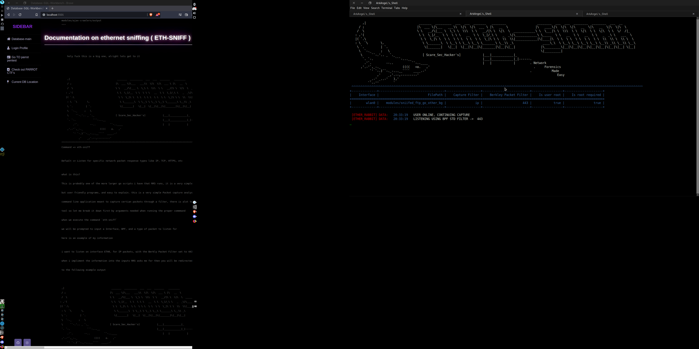

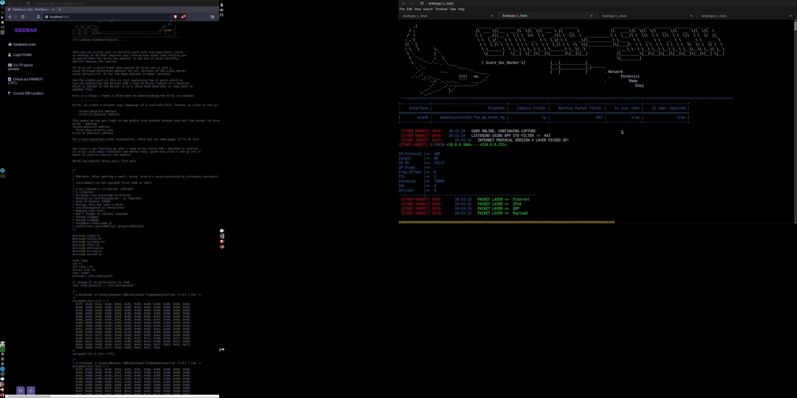

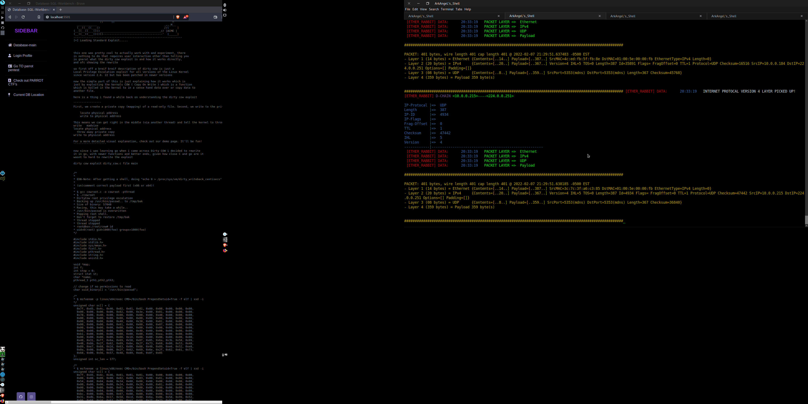

<h2> Password generation </h2>

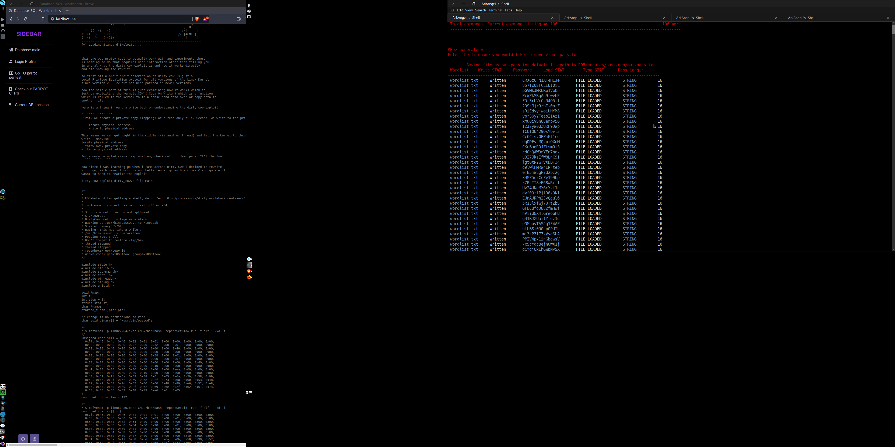

<h2> Ghosted Shell for OS deletion </h2>


<h2> QR Code Generation with and without lists or URLs </h2>


<h2> Username Recon </h2>

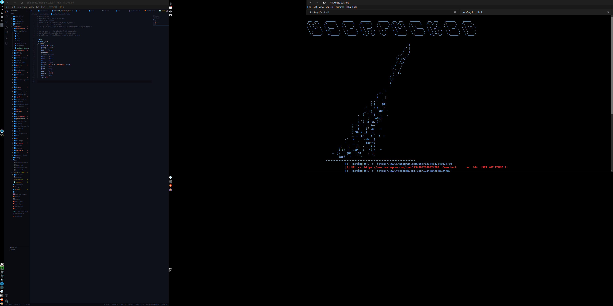

<h2> Fake Access Point Module </h2>

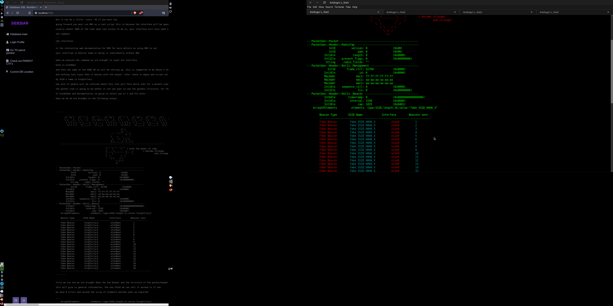

<h2> BOF Scanner for Binary files </h2>

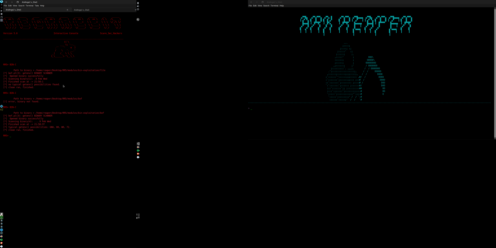


<h2> Proton OSINT Utilities </h2>

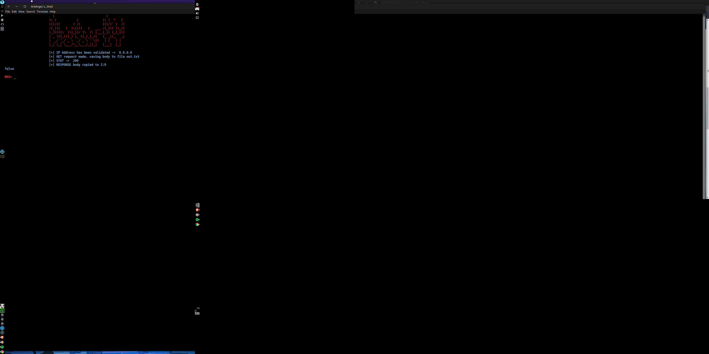

<h2> IP tracing utils </h2>

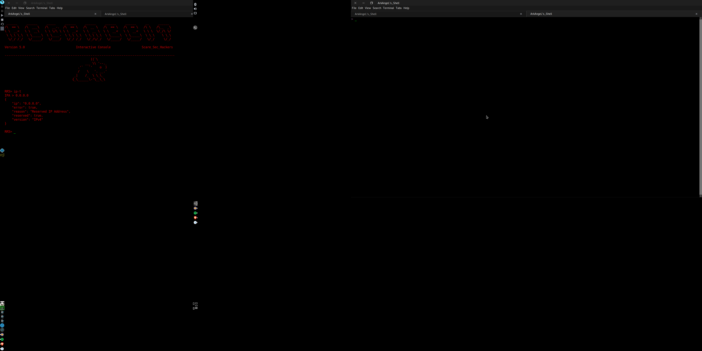

<br>
<hr>
<h1>Join our discord server and ask about RR5 or our security team </h1>


<h2> Or join via URL <h2>

 https://discord.gg/fEWXZyEzSe
 
 <h2> I appreciate you tunning in to look at this project! hope it serves you right </h2>
 
 ```
 
██████  ███████ ██████        ██████   █████  ██████  ██████  ██ ████████       ██    ██ ███████ ██████  ███████ ██  ██████  ███    ██       ███████     ██████  
██   ██ ██      ██   ██       ██   ██ ██   ██ ██   ██ ██   ██ ██    ██          ██    ██ ██      ██   ██ ██      ██ ██    ██ ████   ██       ██         ██  ████ 
██████  █████   ██   ██ █████ ██████  ███████ ██████  ██████  ██    ██    █████ ██    ██ █████   ██████  ███████ ██ ██    ██ ██ ██  ██ █████ ███████    ██ ██ ██ 
██   ██ ██      ██   ██       ██   ██ ██   ██ ██   ██ ██   ██ ██    ██           ██  ██  ██      ██   ██      ██ ██ ██    ██ ██  ██ ██            ██    ████  ██ 
██   ██ ███████ ██████        ██   ██ ██   ██ ██████  ██████  ██    ██            ████   ███████ ██   ██ ███████ ██  ██████  ██   ████       ███████ ██  ██████  
                                                                                                                                                                 
-
 DATA: INF: Red Rabbit -> For Hackers by Hacker
 -
  DATA: INF: Red Rabbit -> Written and Designed by -> Scare_Security | ArkAngeL43 => Your just another fish in the sea
 
                                                                    ^`.                     o
                                                   ^_              \  \                  o  o
                                                   \ \             {   \                 o
                                                   {  \           /     `~~~--__
                                                   {   \___----~~'              `~~-_     ______          _____
                                                    \                         /// a  `~._(_||___)________/___
                                                    / /~~~~-, ,__.    ,      ///  __,,,,)      o  ______/    \
                                                    \/      \/    `~~~;   ,---~~-_`~= \ \------o-'            \
                                                                     /   /            / /
                                                                    '._.'           _/_/
                                                                                    ';|\
 ```
 
 
 <h2> Join our CTF Platform :D And server </h2> 
 
 Parrot Pentest/CTF Discord Server | https://discord.gg/7qhxxA2qbn

 Parrot Pentest/CTF Discord Server Barcode 
 
 
 
 Parrot CTF platform | https://parrot-ctfs.com/
 
 Parrot CTF Barcode  =====
 
 
 

 
 
 
 
 
 
 
