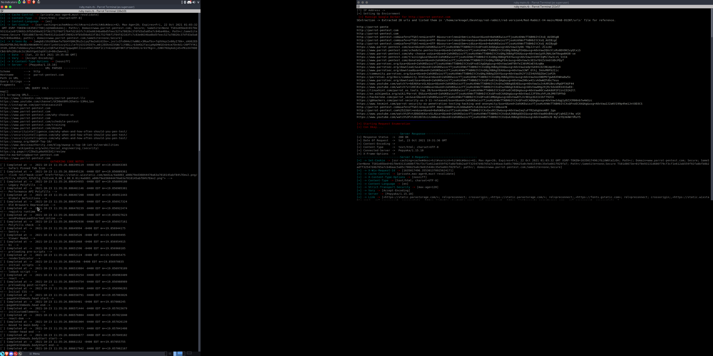

# who?

```

    ______     ______     _____     ______     ______     ______     ______     __     ______  
   /\  == \   /\  ___\   /\  __-.  /\  == \   /\  __ \   /\  == \   /\  == \   /\ \   /\__  _\ 
   \ \  __<   \ \  __\   \ \ \/\ \ \ \  __<   \ \  __ \  \ \  __<   \ \  __<   \ \ \  \/_/\ \/ 
    \ \_\ \_\  \ \_____\  \ \____-  \ \_\ \_\  \ \_\ \_\  \ \_____\  \ \_____\  \ \_\    \ \_\ 
     \/_/ /_/   \/_____/   \/____/   \/_/ /_/   \/_/\/_/   \/_____/   \/_____/   \/_/     \/_/ 
        V 4.0                                 Red Rabbit               Scare_Sec Hackers
                                               
                                               ((`\
                                            ___ \\ '--._
                                         .'`   `'    o  )
                                         /    \   '. __.'
                                       _|    /_  \ \_\_
                                      {_\______\-'\__\_\
                                       -----------------


```


# whats new 

```
BUG FIXES 

install bug -> Sometimes the install file will error out and also wont install the needed libs

802.11 errors -> when you use the fake access point make sure the script is in root to prevent other issues such as the card failing and saying it can not be activated go to the main menu and activate the card with PHY-Dev

whois -> sometimes when you would parse a domain whois will error out, this is not because of the tool it is due to the fact whois parser is very specific and is very sensativ

SQLI -> considering the SQLI is written in perl from like idk 2003 its a very old script and is very very VERY specific this script will not work on modern day SQL servers, ONLY MySQL V 5.x no older and no younger, but fixed alot of the bugs where it would not run and just freez

PHPI -> this one i really do not know how it works, a very old freind gave it to me, had me fix it up, but even we both dont know how it parses, however sometimes the PHP index and request will be only MANUAL INJECTION and can not be injection automates, fixed the error exit status
```

<br>

What is red rabbit? <br>

red rabbit is a exploitation, osint, virus, recon, and hacking script developed with many languages and built for speed to aid hackers in everyday attacks like XSSI, XSSI testing, SQLI testing, PHPI, testing and learning about rouge acess points, file dumping, FTP, running people osint, ajaz spiders and more<br> 

# possible scripts amd usages out of 5-6 menus<br> 
PHPI, SQLI, XSSI, Ajax crawl, ajaz crawl + whois, whois, domain dorker, payload, xss scan, sql scan, ftp scan, port scan, web scan, dhcmp scan, web host scan, whois trace, whois mine, spawn fake ap's, scan local ports, scan the local host, fuzz a file app, web app fuzz, flood a host, scan the local area for bssid's, deauthenticate networks, activate interfaces, grab code notes in html, grab urls in a html file, dive in html, parse html, run MOAB osint, nuke a domain, view my website,  run osint on complex urls 
<br>


# installs and other 
`git clone https://github.com/ArkAngeL43/Red-Rabbit-V4 ; chmod +x ./install.sh ; ./install.sh ; `

# warnings and proper install upon entering<br>
when you use this script when it comes to wireless attacks that use packet gen like <br>
`fake ap`<br>
`Deauthenticaton`<br>
`ftp login captures`<br>
then you will need to run the main file as root like this 

```
Using Current CPU =>  < XAuthenticAMD>
                                           [1] Rouge AP 
                                           [2] Deauth 
                                           [3] Port Scanner 
                                           [A] Web Port Scan 
                                           [4] Flooder 
                                           [5] DHCMP ATK 
                                           [6] Check Connection 
                                           [7] WHOIS Domain 
                                           [8] More 
                                           [9] Start Interface  [aircrack-ng suit]
                                           [01] Start Interface [Iw dev for fake AP]
                                           [02] Stop Interface [iw dev managed mode]
                                           [0] Exit 
                                      >>> 


```

you will need to run 01, then rerun the file MAKE SURE YOU HAVE MON0 as a INTERFACE 802.11

further notes about this secition 
<br>
there will be some errors with the fake AP sometimes it will not spawn this might be because of your network card 
<br>
also when you do option 01 this uses phy dev to erase wlan0 and start a mon0 card, this will be permanant until you chose to stop the interface using 02 ONTOP of that this will also ruin some bluetooth connections if the card is weak, if you do not have a second interface or an extra adapter this will also ruin connections on calls or anything else you may be doing until the script is done, unless its another hacking tool<br>
<br> 

# issues and errors within the script<br>  
<br>
802.11 packetgen utils and wireless cards<br>
<br>
sometimes you wont be able to activate the interface well check the following <br> 
when you started the script and your card were you root?<br>
when you ran the script again after enabling were you root when doing so?<br>
<br>

whois domain <br>
<br>
there is no issue with the script itself it just depends on what domain your targeting, during whois parsing the thing can get stuck and sometimes will not register properly, i prefer using MOAB-OSINT in menu 3 of the script 

SQLI perl module<br>

the PHPI, SQLI, and LW3 module are all perl scripts, this will require some heafty syntaxing. sometimes when you run the PHP script it will error out, i still have not figured out why <br>
<br>
the SQLI script will say "failed to fetch" then the parsed url with query strings, this is probobly because the url isnt being parsed correctly/inputted or the server is not MySQL V5.x or it can be older or even younger, this module ONLY SUPPORTS `MySQL V5.x`<br>
<br>
issues with LW2 and Libwhisker 
<br>
sometimes it will say there is an error in the libwhisker but it shouldnt be an issue, its more of a bug than an issue
<br>
# SCRIPTS USED INSIDE OF RED RABBIT 

`before i go on i want to note that 99% of the scripts are all my scripts asides people like rip, parrot, or some other freinds helped me build `
`scripts like ; LW2, LIBWHISKER, PERL6 and even the php script ( eevn though i fixed 90% of it ) are not mine, i do not claim ownership for these modules or scripts`
some of the main and most used
-----------<br>
PHPI      -> phpi.pl<br>
SQLI      -> sqli.pl<br>
XSSI      -> xssi.py<br> 
port      -> scanner.rs<br>
port web  -> port.rb <br>
ssh sploit-> ssh-sploit | main.rb <br>  
MOAB OSI  -> moab.sh/go.mod.go.sum.main.go.banner.go.regex.go others <br>
<br>


<br>
<br>
this tool is inspired by one of my first ruby frameworks 
for ethical hacking and web/host discovery
that tool was named Rube-Ster which had alot 
of bugs and a shit ton of work that was thrown 
to the side, so i decided to start this project 
which is well Red-Rabbit, you may ask where 
did the name come from, well initally Rube-Sters 
name cam from ruby hence the Rube- and the ster 
came from a bunny i used to know and it was named mr booster
sadly he passed away, anyway hence the name ster
then red rabbit which is a name derived from the og name 


================
Why this tool? 
===============

this tool has alot of options now for choices such as 

wifi Death, Fake AP, web port scanners, host port scanners 
dns, whois, loggers, banner and title parsers, and is written 
from mainly ruby however utilizes, perl, rust, go, ruby, bash, and batch 
you will notice batch is for win32-64 installs and bash is used for linux installs 


=====================
why so many languages 
=====================
well i wanted speed, and since i am currently learning 
rust, c, perl, ruby, go, and batch i decided to put 
my skills to the very well known test 

i also wanted speed 

to parse the results of a title of the domain
and to grab it faster i used golang 

Go -> go-title.go

i also wanted better exception handeling and easy 
etsting, especially with net/http parsing and result testing 

so i used perl so i can throw the URl's into a list, parse them 
and get faster results for testing a internet or stable connections 
perl is also really good for formatting 

i wanted it to somehwta be cross platform 

so i used bash and batch for the installs 

==========
why rust?
===========

simply for faster current network host identification 

====================
why rust IP sniffing?
====================

rust is really fast and a really good language compared to golang 
sure golang is built from assembly but rust over all is faster 
when it comes to handeling, socks, networking threadings and more 
so i built a small IP sniffer from rust 

============================================================
why make the main file in ruby if other languages are faster
============================================================ 

well currently im reading a few books with ruby, and wanted to put 
my ruby skills to the test to see my limits, and ruby is alot better 
when it comes to offensive security tools with networking and sending
payloads over the network or even making something like a windows 
trojan, so i decided to use it 

if your still confused and want to debate then ask yourself 

why is the biggest exploitation framework and the most powerful (MSF/metasploit)
is 97% built from pure ruby? 

=================================== what can this tool do ======================

spawn fake ap's
deauthenticate clients off a network 
do whois domain tracing 
reverse a dns
launch DHCMP attacks 
Flood networks 
Port Scan Hosts 
Port Scan Web Hosts 
IP Parse 
Find ports on the local network 
check your current connection 
Scan the local area for BSSID's and ranges ( its unorganized )
Fuzz File Sharing Websites ( crash and exploit the servers )
Arp Spoof Clients off the current network 
AP scan 


=============================== REQUIREMENTS ========================
perl
python 
rust 
rustc
crates 
cargo 
cpan 
ruby
bash or batch 
golang 

service/script REQUIREMENTS for modules 

ruby ===

net/http
socket 
time 
awaite
optparse 
iw phy
timeout 
http party 
open uri
uri
whois 
whois-parser
colorize
tty-spinner
ruby-gems 
openssl

Go ====

a fucking os 
a sys 
fmt 
strings 
net/http
net/html 

perl === 
Ansi color 
socket 
Strict 
HTTP Tiny

rust === 
use std::env;
use std::process::Command;
use std::io::{self, Write};
use std::net::{IpAddr, TcpStream};
use std::str::FromStr;
use std::process;
use std::sync::mpsc::{Sender, channel};
use std::thread;

# why are injection scripts buggy or using older servers 
```
i am currently working on automating the perl open functionw ith LW2 to open and or work correctly to support a shit ton of servers however with my little knowledge of perl it will be complicated <br>

PHPI reallt is just an example to show you that most things are vulnerable and can be automated, however ive been able to use this once before in the smallest of leaks, sometimes its better to release it than it is to keep it and never add it, if it helped me it can sure help others ```

# why perl? instead of python, ruby, etc
`
i chose perl because perl handels well with networking and connections, and its standard "open" functions allows you to both parse, return, and throw errors in a servers query. i also found it alot better than something like the ruby SQLI i wrote because selenium just- kinda sucks on the end when it comes to injection or xss hunters since it can be very buggy and requires ALOT of threading, error handeling, exception handeling, and returningvalues, i did try it for a bit it just didnt work as well as the perl on did or the python3 xssi.py script for automating xssi`
 

# parrot recon in red rabbit in action scraping parrot-pentest.com

<br>
<br>
<br>
# DNS recon on average attempt

# for more information and images 
`run ruby main.rb then go to the next menu until you find |view my website| which will load the idnex.html file < the mispell is intentional > `
<br>
<br>
<br>
<br>
# different types of menu's
<br>

